<!-- README.md is generated from README.Rmd. Please edit that file -->

# APRENDIZADO DE MÁQUINA ESTATÍSTICO PARA ESTIMATIVA DA EMISSÃO DE CO<sub>2</sub> DO SOLO EM ÁREAS AGRÍCOLAS

**Beneficiário**: Luis Felipe Trevelim

**Responsável**: Alan Rodrigo Panosso

**Resumo**: A concentração de gases de efeito estufa (GEE) na atmosfera,
como o dióxido de carbono (CO<sub>2</sub>), aumentou consideravelmente
devido a fontes antropogênicas. No Brasil, atividades agrícolas e
florestais contribuem substancialmente para as emissões de
CO<sub>2</sub>, principalmente devido ao desmatamento e à conversão de
florestas nativas. Estudos anteriores demonstraram que FCO2 pode ser
modelada com alta precisão usando uma grande quantidade de variáveis
ambientais. No entanto, a conversão a longo prazo de florestas nativas
para agroecossistemas ainda é pouco compreendida, especialmente no
contexto brasileiro. Assim, a hipótese central é que as mudanças no uso
da terra para fins agrícolas alteram os atributos químicos e físicos do
solo, induzindo mudanças na emissão de CO<sub>2</sub>. Este projeto visa
investigar a emissão de CO<sub>2</sub> do solo (FCO2) em áreas agrícolas
do bioma Cerrado, utilizando técnicas de aprendizado de máquina
estatístico para modelar FCO2 com base em demais variáveis associadas.

**Palavras-chaves**: respiração do solo, inteligência artificial,
mudanças climáticas, aprendizado de máquina.

### [1-Faxina](https://arpanosso.github.io/projeto-trevelimlf/Docs/faxina.html)

### [2-Importação e Tratamento](https://arpanosso.github.io/projeto-trevelimlf/Docs/importacao_tratamento.html)

### 3 - Aprendizado de Máquina

#### Carregando os pacotes

``` r
library(tidyverse)
library(patchwork)
library(ggspatial)
library(readxl)
library(skimr)
library(tidymodels)
library(ISLR)
library(modeldata)
library(vip)
library(ggpubr)
theme_set(theme_bw())
```

#### Entrando com o banco de dados

``` r
data_set <- read_rds("data/data-set.rds")
glimpse(data_set)
#> Rows: 14,977
#> Columns: 51
#> $ data           <dttm> 2001-07-10, 2001-07-10, 2001-07-10, 2001-07-10, 2001-0…
#> $ year           <dbl> 2001, 2001, 2001, 2001, 2001, 2001, 2001, 2001, 2001, 2…
#> $ month          <dbl> 7, 7, 7, 7, 7, 7, 7, 7, 7, 7, 7, 7, 7, 7, 7, 7, 7, 7, 7…
#> $ cultura        <chr> "milho_soja", "milho_soja", "milho_soja", "milho_soja",…
#> $ x              <dbl> 0, 40, 80, 10, 25, 40, 55, 70, 20, 40, 60, 10, 70, 30, …
#> $ y              <dbl> 0, 0, 0, 10, 10, 10, 10, 10, 20, 20, 20, 25, 25, 30, 30…
#> $ longitude_muni <dbl> -48.29829, -48.29829, -48.29829, -48.29829, -48.29829, …
#> $ latitude_muni  <dbl> -21.20178, -21.20178, -21.20178, -21.20178, -21.20178, …
#> $ experimento    <chr> "Espacial", "Espacial", "Espacial", "Espacial", "Espaci…
#> $ manejo         <fct> convencional, convencional, convencional, convencional,…
#> $ tratamento     <fct> AD_GN, AD_GN, AD_GN, AD_GN, AD_GN, AD_GN, AD_GN, AD_GN,…
#> $ fco2           <dbl> 1.080, 0.825, 1.950, 0.534, 0.893, 0.840, 1.110, 1.840,…
#> $ ts             <dbl> 18.73, 18.40, 19.20, 18.28, 18.35, 18.47, 19.10, 18.77,…
#> $ us             <dbl> NA, NA, NA, NA, NA, NA, NA, NA, NA, NA, NA, NA, NA, NA,…
#> $ ph             <dbl> 5.1, 5.1, 5.8, 5.3, 5.5, 5.7, 5.6, 6.4, 5.3, 5.8, 5.5, …
#> $ mo             <dbl> 20, 24, 25, 23, 23, 21, 26, 23, 25, 24, 26, 20, 25, 25,…
#> $ p              <dbl> 46, 26, 46, 78, 60, 46, 55, 92, 55, 60, 48, 71, 125, 38…
#> $ k              <dbl> 2.4, 2.2, 5.3, 3.6, 3.4, 2.9, 4.0, 2.3, 3.3, 3.6, 4.1, …
#> $ ca             <dbl> 25, 30, 41, 27, 33, 38, 35, 28, 29, 36, 37, 29, 50, 27,…
#> $ mg             <dbl> 11, 11, 25, 11, 15, 20, 16, 12, 11, 17, 15, 11, 30, 10,…
#> $ h_al           <dbl> 31, 31, 22, 28, 27, 22, 22, 12, 31, 28, 28, 31, 18, 31,…
#> $ sb             <dbl> 38.4, 43.2, 71.3, 41.6, 50.6, 60.9, 55.0, 44.2, 43.3, 5…
#> $ ctc            <dbl> 69.4, 74.2, 93.3, 69.6, 77.9, 82.9, 77.0, 173.3, 74.3, …
#> $ v              <dbl> 55, 58, 76, 60, 65, 73, 71, 93, 58, 67, 67, 58, 82, 57,…
#> $ ds             <dbl> NA, NA, NA, NA, NA, NA, NA, NA, NA, NA, NA, NA, NA, NA,…
#> $ macro          <dbl> NA, NA, NA, NA, NA, NA, NA, NA, NA, NA, NA, NA, NA, NA,…
#> $ micro          <dbl> NA, NA, NA, NA, NA, NA, NA, NA, NA, NA, NA, NA, NA, NA,…
#> $ vtp            <dbl> NA, NA, NA, NA, NA, NA, NA, NA, NA, NA, NA, NA, NA, NA,…
#> $ pla            <dbl> NA, NA, NA, NA, NA, NA, NA, NA, NA, NA, NA, NA, NA, NA,…
#> $ at             <dbl> NA, NA, NA, NA, NA, NA, NA, NA, NA, NA, NA, NA, NA, NA,…
#> $ silte          <dbl> NA, NA, NA, NA, NA, NA, NA, NA, NA, NA, NA, NA, NA, NA,…
#> $ arg            <dbl> NA, NA, NA, NA, NA, NA, NA, NA, NA, NA, NA, NA, NA, NA,…
#> $ hlifs          <dbl> NA, NA, NA, NA, NA, NA, NA, NA, NA, NA, NA, NA, NA, NA,…
#> $ xco2_trend     <dbl> NA, NA, NA, NA, NA, NA, NA, NA, NA, NA, NA, NA, NA, NA,…
#> $ xco2           <dbl> NA, NA, NA, NA, NA, NA, NA, NA, NA, NA, NA, NA, NA, NA,…
#> $ sif            <dbl> NA, NA, NA, NA, NA, NA, NA, NA, NA, NA, NA, NA, NA, NA,…
#> $ tmed           <dbl> 19.9, 19.9, 19.9, 19.9, 19.9, 19.9, 19.9, 19.9, 19.9, 1…
#> $ tmax           <dbl> NA, NA, NA, NA, NA, NA, NA, NA, NA, NA, NA, NA, NA, NA,…
#> $ tmin           <dbl> NA, NA, NA, NA, NA, NA, NA, NA, NA, NA, NA, NA, NA, NA,…
#> $ umed           <dbl> 58.9, 58.9, 58.9, 58.9, 58.9, 58.9, 58.9, 58.9, 58.9, 5…
#> $ umax           <dbl> NA, NA, NA, NA, NA, NA, NA, NA, NA, NA, NA, NA, NA, NA,…
#> $ umin           <dbl> NA, NA, NA, NA, NA, NA, NA, NA, NA, NA, NA, NA, NA, NA,…
#> $ pk_pa          <dbl> 94.65, 94.65, 94.65, 94.65, 94.65, 94.65, 94.65, 94.65,…
#> $ rad            <dbl> 16.01, 16.01, 16.01, 16.01, 16.01, 16.01, 16.01, 16.01,…
#> $ par            <dbl> NA, NA, NA, NA, NA, NA, NA, NA, NA, NA, NA, NA, NA, NA,…
#> $ eto            <dbl> 6.98, 6.98, 6.98, 6.98, 6.98, 6.98, 6.98, 6.98, 6.98, 6…
#> $ velmax         <dbl> NA, NA, NA, NA, NA, NA, NA, NA, NA, NA, NA, NA, NA, NA,…
#> $ velmin         <dbl> NA, NA, NA, NA, NA, NA, NA, NA, NA, NA, NA, NA, NA, NA,…
#> $ dir_vel        <dbl> NA, NA, NA, NA, NA, NA, NA, NA, NA, NA, NA, NA, NA, NA,…
#> $ chuva          <dbl> 0, 0, 0, 0, 0, 0, 0, 0, 0, 0, 0, 0, 0, 0, 0, 0, 0, 0, 0…
#> $ inso           <dbl> 10.1, 10.1, 10.1, 10.1, 10.1, 10.1, 10.1, 10.1, 10.1, 1…
```

##### Extraindo o grupo de variáveis

``` r
time_var <- data_set |> select(data:month) |> names()
catego_var <- data_set |> select(cultura, manejo, tratamento) |> names()
din_var <- data_set |> select(fco2:us,pla) |> names()
chemical_var <- data_set |> select(ph:v,hlifs) |> names()
physical_var <- data_set |> select(ds:vtp) |> names()
textural_var <- data_set |> select(at:arg) |> names()
textural_var <- data_set |> select(at:arg) |> names()
orbital_var <- data_set |> select(xco2_trend:sif) |> names()
meteorological_var <- data_set |> select(tmed:inso) |> names()
```

### Dividindo a base entre treino e teste

``` r
fco2_initial_split <- initial_split(data_set, prop = 0.80)
fco2_train <- training(fco2_initial_split)
# fco2_test <- testing(fco2_initial_split)
# visdat::vis_miss(fco2_test)
fco2_train  |>  
  ggplot(aes(x=fco2, y=..density..))+
  geom_histogram(bins = 30, color="black",  fill="lightgray")+
  geom_density(alpha=.05,fill="red")+
  theme_bw() +
  labs(x="fco2 - treino", y = "Densidade")
```

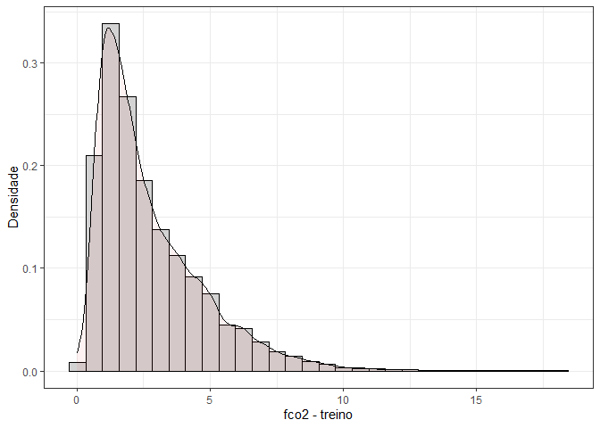<!-- -->

``` r
fco2_testing <- testing(fco2_initial_split)
fco2_testing  |>  
  ggplot(aes(x=fco2, y=..density..))+
  geom_histogram(bins = 30, color="black",  fill="lightgray")+
  geom_density(alpha=.05,fill="blue")+
  theme_bw() +
  labs(x="fco2 - teste", y = "Densidade")
```

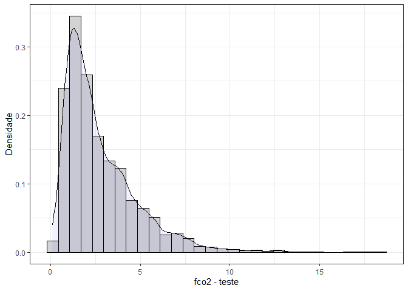<!-- -->

### Definindo a Reamostragem

``` r
fco2_resamples <- vfold_cv(fco2_train, v = 5)
```

``` r

fco2_recipe <- recipe(fco2 ~ ., 
                      data = fco2_train |>  
            select(fco2:inso, -xco2_trend) # 
) |>   
  step_naomit(all_outcomes()) |>  # remove linhas sem fco2  
  step_naomit(c(ts, us)) |>  # retira NAs somente de ts e us
  step_novel(all_nominal_predictors()) |>  # evitar problemas quando aparece categoria nova
  step_zv(all_predictors()) |> # evita problemas com variância zero 
  # step_poly(c(us,ts), degree = 2)  |> #polinômios de us e ts de grau 2  
  step_impute_median(all_numeric_predictors()) |>  # inputação da mediana - antes de normalize
  step_normalize(all_numeric_predictors())  #|>   padronização normal (x-mu)/sigmma
  # step_dummy(all_nominal_predictors()) # converte fatores em variáveis binárias
bake(prep(fco2_recipe), new_data = NULL)
#> # A tibble: 10,369 × 39
#>        ts      us      ph      mo       p       k     ca     mg    h_al     sb
#>     <dbl>   <dbl>   <dbl>   <dbl>   <dbl>   <dbl>  <dbl>  <dbl>   <dbl>  <dbl>
#>  1  0.714 -0.697  -0.806   0.902  -0.497  -0.0999 -0.383  0.161  1.05   -0.248
#>  2  0.844 -1.26   -1.33    0.577  -0.653  -0.670  -0.735 -0.219  0.777  -0.674
#>  3 -1.35  -0.652  -0.981  -1.04    0.743   0.850  -0.453 -0.219  1.67   -0.300
#>  4  0.811 -0.810  -1.16   -0.0710 -0.601  -0.622  -0.875 -1.55   1.33   -1.14 
#>  5  0.146 -0.481   0.423   1.47   -0.549  -0.290   1.17   1.11   0.0879  1.14 
#>  6 -0.306 -0.810   1.51    0.0409  0.0155 -0.410   0.842  0.732 -0.152   0.759
#>  7  0.656 -0.0188  0.0722  0.496  -0.136   0.612   1.31   0.922  0.295   1.29 
#>  8 -0.384  0.207   0.599   1.85    0.194   2.75    1.12   0.503  0.0952  1.27 
#>  9  1.17  -1.15   -1.16    0.334  -0.756   0.327  -0.875 -0.980  1.33   -0.877
#> 10  0.698 -0.245  -0.981   0.0101 -0.342  -0.670  -0.805 -1.36   1.67   -1.04 
#> # ℹ 10,359 more rows
#> # ℹ 29 more variables: ctc <dbl>, v <dbl>, ds <dbl>, macro <dbl>, micro <dbl>,
#> #   vtp <dbl>, pla <dbl>, at <dbl>, silte <dbl>, arg <dbl>, hlifs <dbl>,
#> #   xco2 <dbl>, sif <dbl>, tmed <dbl>, tmax <dbl>, tmin <dbl>, umed <dbl>,
#> #   umax <dbl>, umin <dbl>, pk_pa <dbl>, rad <dbl>, par <dbl>, eto <dbl>,
#> #   velmax <dbl>, velmin <dbl>, dir_vel <dbl>, chuva <dbl>, inso <dbl>,
#> #   fco2 <dbl>
```

## Boosting gradient tree (xgb)

``` r
cores = 4
fco2_xgb_model <- boost_tree(
  mtry = 0.8,
  trees = tune(), # <---------------
  min_n = 5,
  tree_depth = 4,
  loss_reduction = 0, # lambda
  learn_rate = tune(), # epsilon
  sample_size = 0.8
)  %>%
  set_mode("regression")  %>%
  set_engine("xgboost", nthread = cores, counts = FALSE)

fco2_xgb_wf <- workflow()  %>%
  add_model(fco2_xgb_model) %>%
  add_recipe(fco2_recipe)

grid_xgb <- grid_regular(
  learn_rate(range =  c(0.005, 0.3)), ## <---------
  trees(range = c(3, 100)), ## <---------
  levels = 2 
)
```

#### Passo 1

``` r
fco2_xgb_tune_grid <- tune_grid(
 fco2_xgb_wf,
  resamples = fco2_resamples,
  grid = grid_xgb,
  metrics = metric_set(rmse)
)
autoplot(fco2_xgb_tune_grid)
```

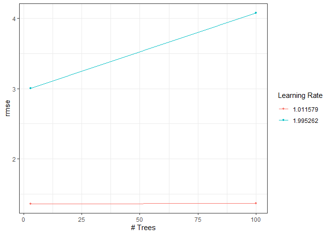<!-- -->

``` r
fco2_xgb_tune_grid   %>%   show_best(metric = "rmse", n = 5)
#> # A tibble: 4 × 8
#>   trees learn_rate .metric .estimator  mean     n std_err .config        
#>   <int>      <dbl> <chr>   <chr>      <dbl> <int>   <dbl> <chr>          
#> 1     3       1.01 rmse    standard    1.37     5  0.0236 pre0_mod1_post0
#> 2   100       1.01 rmse    standard    1.37     5  0.0410 pre0_mod3_post0
#> 3     3       2.00 rmse    standard    3.00     5  0.0256 pre0_mod2_post0
#> 4   100       2.00 rmse    standard    4.07     5  0.344  pre0_mod4_post0
```

``` r
fco2_xgb_select_best_passo1 <- fco2_xgb_tune_grid %>%
  select_best(metric = "rmse")
fco2_xgb_select_best_passo1
#> # A tibble: 1 × 3
#>   trees learn_rate .config        
#>   <int>      <dbl> <chr>          
#> 1     3       1.01 pre0_mod1_post0
```

#### Passo 2

``` r
fco2_xgb_model <- boost_tree(
  mtry = 0.8,
  trees = fco2_xgb_select_best_passo1$trees,
  min_n = tune(),
  tree_depth = tune(),
  loss_reduction = 0,
  learn_rate = fco2_xgb_select_best_passo1$learn_rate,
  sample_size = 0.8
) %>%
  set_mode("regression")  %>%
  set_engine("xgboost", nthread = cores, counts = FALSE)

#### Workflow
fco2_xgb_wf <- workflow() %>%
    add_model(fco2_xgb_model)   %>%
    add_recipe(fco2_recipe)

#### Grid
fco2_xgb_grid <- grid_regular(
  tree_depth(range = c(1, 4)), ## <---------
  min_n(range = c(5, 60)), ## <---------
  levels = 2 ## <---------
)

fco2_xgb_tune_grid <- fco2_xgb_wf   %>%
  tune_grid(
    resamples =fco2_resamples,
    grid = fco2_xgb_grid,
    control = control_grid(save_pred = TRUE, verbose = FALSE, allow_par = TRUE),
    metrics = metric_set(rmse)
  )

#### Melhores hiperparâmetros
autoplot(fco2_xgb_tune_grid)
```

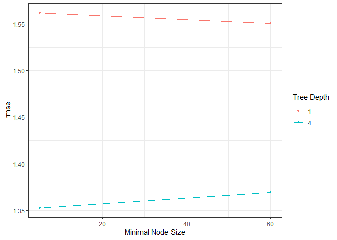<!-- -->

``` r
fco2_xgb_tune_grid  %>%
  show_best(metric = "rmse", n = 5)
#> # A tibble: 4 × 8
#>   min_n tree_depth .metric .estimator  mean     n std_err .config        
#>   <int>      <int> <chr>   <chr>      <dbl> <int>   <dbl> <chr>          
#> 1     5          4 rmse    standard    1.35     5  0.0368 pre0_mod2_post0
#> 2    60          4 rmse    standard    1.37     5  0.0219 pre0_mod4_post0
#> 3    60          1 rmse    standard    1.55     5  0.0120 pre0_mod3_post0
#> 4     5          1 rmse    standard    1.56     5  0.0140 pre0_mod1_post0
fco2_xgb_select_best_passo2 <- fco2_xgb_tune_grid  %>%
  select_best(metric = "rmse")
fco2_xgb_select_best_passo2
#> # A tibble: 1 × 3
#>   min_n tree_depth .config        
#>   <int>      <int> <chr>          
#> 1     5          4 pre0_mod2_post0
```

## Passo 3

``` r
fco2_xgb_model <- boost_tree(
  mtry = 0.8,
  trees = fco2_xgb_select_best_passo1$trees,
  min_n = fco2_xgb_select_best_passo2$min_n,
  tree_depth = fco2_xgb_select_best_passo2$tree_depth,
  loss_reduction =tune(),
  learn_rate = fco2_xgb_select_best_passo1$learn_rate,
  sample_size = 0.8
)  %>%
  set_mode("regression")  %>%
  set_engine("xgboost", nthread = cores, counts = FALSE)

#### Workflow
fco2_xgb_wf <- workflow()  %>%
    add_model(fco2_xgb_model)  %>%
    add_recipe(fco2_recipe)

#### Grid
fco2_xgb_grid <- grid_regular(
  loss_reduction(range = c(0.01, 8)), ## <---------
  levels = 2## <---------
)

fco2_xgb_tune_grid <- fco2_xgb_wf   %>%
  tune_grid(
    resamples = fco2_resamples,
    grid = fco2_xgb_grid,
    control = control_grid(save_pred = TRUE,
                           verbose = FALSE,
                           allow_par = TRUE),
    metrics = metric_set(rmse)
  )

#### Melhores hiperparâmetros
autoplot(fco2_xgb_tune_grid)
```

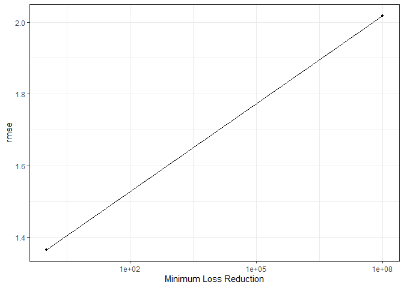<!-- -->

``` r
fco2_xgb_tune_grid   %>%   show_best(metric = "rmse", n = 5)
#> # A tibble: 2 × 7
#>   loss_reduction .metric .estimator  mean     n std_err .config        
#>            <dbl> <chr>   <chr>      <dbl> <int>   <dbl> <chr>          
#> 1           1.02 rmse    standard    1.37     5  0.0236 pre0_mod1_post0
#> 2   100000000    rmse    standard    2.02     5  0.0178 pre0_mod2_post0
fco2_xgb_select_best_passo3 <- fco2_xgb_tune_grid %>% select_best(metric = "rmse")
fco2_xgb_select_best_passo3
#> # A tibble: 1 × 2
#>   loss_reduction .config        
#>            <dbl> <chr>          
#> 1           1.02 pre0_mod1_post0
```

### Passo 4

``` r
fco2_xgb_model <- boost_tree(
  mtry = tune(),
  trees = fco2_xgb_select_best_passo1$trees,
  min_n = fco2_xgb_select_best_passo2$min_n,
  tree_depth = fco2_xgb_select_best_passo2$tree_depth,
  loss_reduction = fco2_xgb_select_best_passo3$loss_reduction,
  learn_rate = fco2_xgb_select_best_passo1$learn_rate,
  sample_size = tune()
)%>%
  set_mode("regression")  |>
  set_engine("xgboost", nthread = cores, counts = FALSE)

#### Workflow
fco2_xgb_wf <- workflow()  %>%
    add_model(fco2_xgb_model)  %>%
    add_recipe(fco2_recipe)

#### Grid
fco2_xgb_grid <- expand.grid(
    sample_size = seq(0.5, 1.0, length.out = 2), ## <---------
    mtry = seq(0.1, 1.0, length.out = 2) ## <---------
)

fco2_xgb_tune_grid <- fco2_xgb_wf   %>%
  tune_grid(
    resamples = fco2_resamples,
    grid = fco2_xgb_grid,
    control = control_grid(save_pred = TRUE,
                           verbose = FALSE,
                           allow_par = TRUE),
    metrics = metric_set(rmse)
  )

autoplot(fco2_xgb_tune_grid)
```

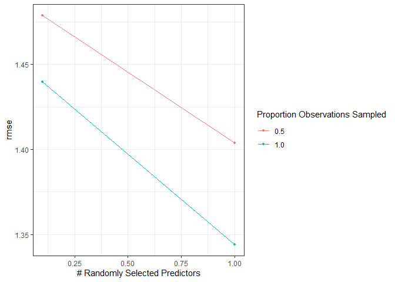<!-- -->

``` r
fco2_xgb_tune_grid  %>%
  show_best(metric = "rmse", n = 5)
#> # A tibble: 4 × 8
#>    mtry sample_size .metric .estimator  mean     n std_err .config        
#>   <dbl>       <dbl> <chr>   <chr>      <dbl> <int>   <dbl> <chr>          
#> 1   1           1   rmse    standard    1.34     5  0.0373 pre0_mod4_post0
#> 2   1           0.5 rmse    standard    1.40     5  0.0195 pre0_mod3_post0
#> 3   0.1         1   rmse    standard    1.44     5  0.0246 pre0_mod2_post0
#> 4   0.1         0.5 rmse    standard    1.48     5  0.0169 pre0_mod1_post0
fco2_xgb_select_best_passo4 <- fco2_xgb_tune_grid   %>%
  select_best(metric = "rmse")
fco2_xgb_select_best_passo4
#> # A tibble: 1 × 3
#>    mtry sample_size .config        
#>   <dbl>       <dbl> <chr>          
#> 1     1           1 pre0_mod4_post0
```

### Passo 5

``` r
fco2_xgb_model <- boost_tree(
  mtry = fco2_xgb_select_best_passo4$mtry,
  trees = tune(),
  min_n = fco2_xgb_select_best_passo2$min_n,
  tree_depth = fco2_xgb_select_best_passo2$tree_depth,
  loss_reduction = fco2_xgb_select_best_passo3$loss_reduction,
  learn_rate = tune(),
  sample_size = fco2_xgb_select_best_passo4$sample_size
) %>%
  set_mode("regression")  %>%
  set_engine("xgboost", nthread = cores, counts = FALSE)

#### Workflow
fco2_xgb_wf <- workflow() %>%
    add_model(fco2_xgb_model)  %>%
    add_recipe(fco2_recipe)

#### Grid
fco2_xgb_grid <- expand.grid(
    learn_rate = c(0.10, 0.15, 0.25, 0.50),
    trees = c(100, 250, 500)
)

fco2_xgb_tune_grid <- fco2_xgb_wf   %>%
  tune_grid(
    resamples = fco2_resamples,
    grid = fco2_xgb_grid,
    control = control_grid(save_pred = TRUE,
                           verbose = FALSE,
                           allow_par = TRUE),
    metrics = metric_set(rmse)
  )

#### Melhores hiperparâmetros
autoplot(fco2_xgb_tune_grid)
```

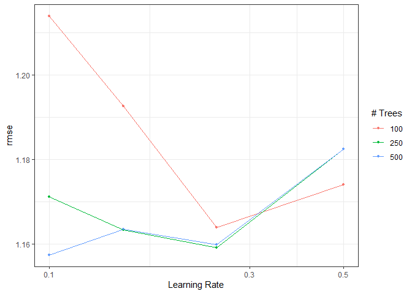<!-- -->

``` r
fco2_xgb_tune_grid  %>%
  show_best(metric = "rmse", n = 5)
#> # A tibble: 5 × 8
#>   trees learn_rate .metric .estimator  mean     n std_err .config         
#>   <dbl>      <dbl> <chr>   <chr>      <dbl> <int>   <dbl> <chr>           
#> 1   500       0.1  rmse    standard    1.16     5 0.0123  pre0_mod09_post0
#> 2   250       0.25 rmse    standard    1.16     5 0.00937 pre0_mod07_post0
#> 3   500       0.25 rmse    standard    1.16     5 0.00900 pre0_mod11_post0
#> 4   250       0.15 rmse    standard    1.16     5 0.0163  pre0_mod06_post0
#> 5   500       0.15 rmse    standard    1.16     5 0.0148  pre0_mod10_post0
fco2_xgb_select_best_passo5 <- fco2_xgb_tune_grid %>%
  select_best(metric = "rmse")
fco2_xgb_select_best_passo5
#> # A tibble: 1 × 3
#>   trees learn_rate .config         
#>   <dbl>      <dbl> <chr>           
#> 1   500        0.1 pre0_mod09_post0
```

## Desempenho dos modelos finais

``` r
fco2_xgb_model <- boost_tree(
  mtry = fco2_xgb_select_best_passo4$mtry,
  trees = fco2_xgb_select_best_passo5$trees,
  min_n = fco2_xgb_select_best_passo2$min_n,
  tree_depth = fco2_xgb_select_best_passo2$tree_depth,
  loss_reduction = fco2_xgb_select_best_passo3$loss_reduction,
  learn_rate = fco2_xgb_select_best_passo5$learn_rate,
  sample_size = fco2_xgb_select_best_passo4$sample_size
) %>%
  set_mode("regression")  %>%
  set_engine("xgboost", nthread = cores, counts = FALSE)
```

``` r
df <- data.frame(
  mtry = fco2_xgb_select_best_passo4$mtry,
  trees = fco2_xgb_select_best_passo5$trees,
  min_n = fco2_xgb_select_best_passo2$min_n,
  tree_depth = fco2_xgb_select_best_passo2$tree_depth,
  loss_reduction = fco2_xgb_select_best_passo3$loss_reduction,
  learn_rate = fco2_xgb_select_best_passo5$learn_rate,
  sample_size = fco2_xgb_select_best_passo4$sample_size
)
fco2_xgb_wf <- fco2_xgb_wf %>% finalize_workflow(df) # <------
fco2_xgb_last_fit <- last_fit(fco2_xgb_wf, fco2_initial_split) # <--------
```

## Criar Preditos

``` r
fco2_test_preds <- bind_rows(
  collect_predictions(fco2_xgb_last_fit)  %>%
    mutate(modelo = "xgb")
)
```

``` r
fco2_test_preds %>%
  ggplot(aes(x=.pred, y = fco2)) +
  geom_point()+
  theme_bw() +
  geom_smooth(method = "lm") +
  stat_regline_equation(ggplot2::aes(
  label =  paste(..eq.label.., ..rr.label.., sep = "*plain(\",\")~~")))+
  geom_abline (slope=1, linetype = "dashed", color="Red")
```

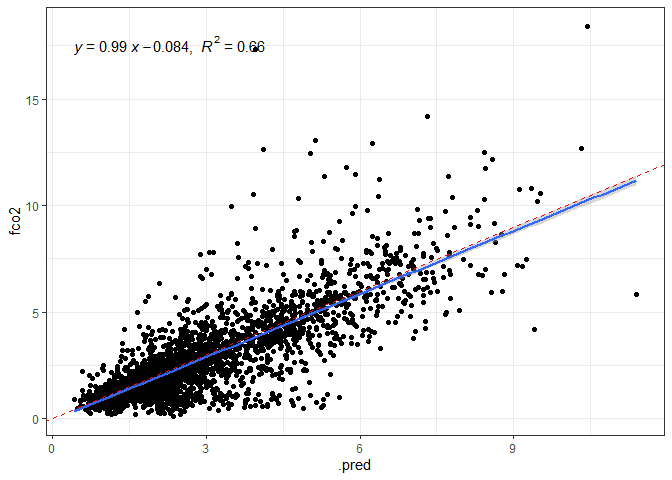<!-- -->

## Salvando o modelo final

``` r
fco2_modelo_final <- fco2_xgb_wf |>
  fit(data_set)
saveRDS(fco2_modelo_final, "models/fco2_modelo_xgb_.rds")
```

``` r
fco2_xgb_last_fit_model <-fco2_xgb_last_fit$.workflow[[1]]$fit$fit
# vip(fco2_xgb_last_fit_model,
#     aesthetics = list(color = "black", fill = "orange")) +
#     theme(axis.text.y=element_text(size=rel(1.5)),
#           axis.text.x=element_text(size=rel(1.5)),
#           axis.title.x=element_text(size=rel(1.5))
#           )
```

``` r
importance_top_10 <- vi(fco2_xgb_last_fit_model) |>
  arrange(desc(Importance)) |>
  slice(1:10)

importance_top_10 |>
  mutate(feature_type = case_when(
    Variable %in% physical_var   ~ "físicos",
    Variable %in% chemical_var  ~ "químicos",
    Variable %in% din_var ~ "dinâmicos",
    Variable %in% meteorological_var ~ "climáticos",
    Variable %in% orbital_var  ~ "orbitais",
    Variable %in% textural_var  ~ "textura",
    Variable %in% time_var  ~ "tempo",
    TRUE                        ~ "manejo"
  ),
  Variable = Variable |> fct_reorder(Importance)) |>
  ggplot(aes(x=Importance, y=Variable, fill = feature_type)) +
  geom_col(color="black") +
  theme_bw()+
  labs(x = "Importância",y="",
       fill="Grupo") +
  theme(legend.position = "top") +
  scale_fill_viridis_d()
```

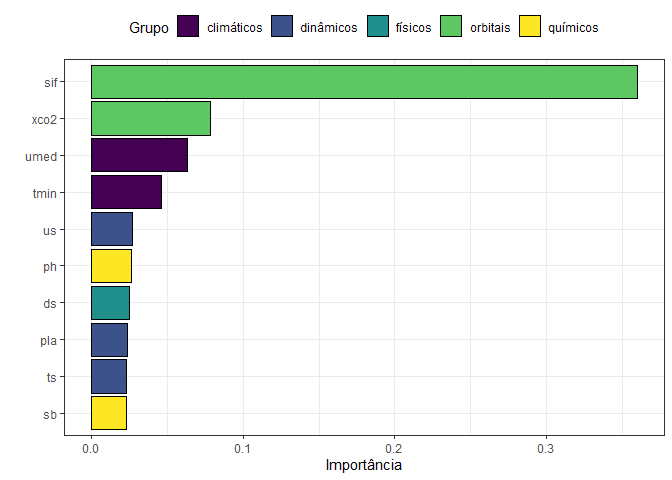<!-- -->

## Métricas

``` r
da <- fco2_test_preds %>%
  filter(fco2 > 0, .pred>0 )

my_r <- cor(da$fco2,da$.pred)
my_r2 <- my_r*my_r
my_mse <- Metrics::mse(da$fco2,da$.pred)
my_rmse <- Metrics::rmse(da$fco2,
                         da$.pred)
my_mae <- Metrics::mae(da$fco2,da$.pred)
my_mape <- Metrics::mape(da$fco2,da$.pred)*100

vector_of_metrics <- c(r=my_r, R2=my_r2, MSE=my_mse, RMSE=my_rmse, MAE=my_mae, MAPE=my_mape)
print(data.frame(vector_of_metrics))
#>      vector_of_metrics
#> r            0.8114343
#> R2           0.6584256
#> MSE          1.4075033
#> RMSE         1.1863825
#> MAE          0.7666250
#> MAPE        45.4193551
```

## Random Forest

#### Definir os parâmetros da tunagem

``` r
fco2_rf_model <- rand_forest(
  min_n = tune(),
  mtry = tune(),
  trees = tune()
) %>%
  set_mode("regression") %>%
  set_engine("ranger", importance = "impurity")
```

#### Workflow e tunagem

``` r
fco2_rf_wf <- workflow()   |>
  add_model(fco2_rf_model) |>
  add_recipe(fco2_recipe)

grid_rf <- grid_latin_hypercube(
  min_n(range = c(1, 10)),
  mtry(range = c(8, 20)),
  trees(range = c(150, 200)),
  size = 2
)

fco2_rf_tune_grid <- tune_grid(
  fco2_rf_wf,
  resamples = fco2_resamples,
  grid = grid_rf,
  metrics = metric_set(rmse) )
autoplot(fco2_rf_tune_grid)
```

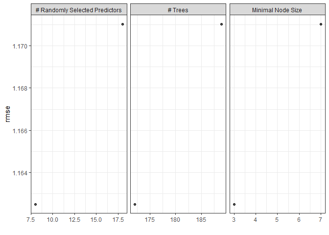<!-- -->

### Coletando métricas

``` r
collect_metrics(fco2_rf_tune_grid)
#> # A tibble: 2 × 9
#>    mtry trees min_n .metric .estimator  mean     n std_err .config        
#>   <int> <int> <int> <chr>   <chr>      <dbl> <int>   <dbl> <chr>          
#> 1     8   172     3 rmse    standard    1.16     5  0.0174 pre0_mod1_post0
#> 2    18   189     7 rmse    standard    1.17     5  0.0183 pre0_mod2_post0
fco2_rf_tune_grid |>
  show_best(metric = "rmse", n = 6)
#> # A tibble: 2 × 9
#>    mtry trees min_n .metric .estimator  mean     n std_err .config        
#>   <int> <int> <int> <chr>   <chr>      <dbl> <int>   <dbl> <chr>          
#> 1     8   172     3 rmse    standard    1.16     5  0.0174 pre0_mod1_post0
#> 2    18   189     7 rmse    standard    1.17     5  0.0183 pre0_mod2_post0
```

### Desempenho do modelo final

``` r
fco2_rf_best_params <- select_best(fco2_rf_tune_grid, metric = "rmse")
fco2_rf_wf <- fco2_rf_wf |>
  finalize_workflow(fco2_rf_best_params)
fco2_rf_last_fit <- last_fit(fco2_rf_wf, fco2_initial_split)

## Criando os preditos
fco2_test_preds <- bind_rows(
  collect_predictions(fco2_rf_last_fit)  |>
    mutate(modelo = "rf"))

fco2_test <- testing(fco2_initial_split)

fco2_test_preds |>
  ggplot(aes(x=.pred, y=fco2)) +
  geom_point()+
  theme_bw() +
  geom_smooth(method = "lm") +
  stat_regline_equation(ggplot2::aes(
  label =  paste(..eq.label.., ..rr.label.., sep = "*plain(\",\")~~"))) +
  geom_abline (slope=1, linetype = "dashed", color="Red")
```

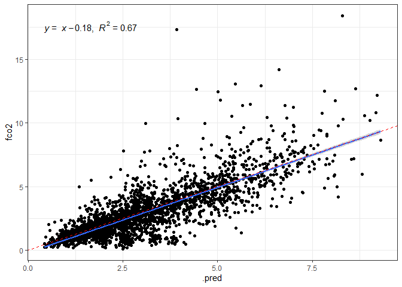<!-- -->

## Salvando o modelo final

``` r
fco2_modelo_final <- fco2_rf_wf |>
  fit(data_set)
saveRDS(fco2_modelo_final, "models/fco2_modelo_rf_1.rds")
```

``` r
# Extract the actual training data from your workflow
 fco2_rf_last_fit_model <-fco2_rf_last_fit$.workflow[[1]]$fit$fit
 # vip(fco2_rf_last_fit_model,
 #     aesthetics = list(color = "black", fill = "orange")) +
 #     theme(axis.text.y=element_text(size=rel(1.5)),
 #           axis.text.x=element_text(size=rel(1.5)),
 #           axis.title.x=element_text(size=rel(1.5))
 #           )
```

``` r
importance_top_10 <- vi(fco2_rf_last_fit_model) |>
  arrange(desc(Importance)) |>
  slice(1:10)

importance_top_10 |>
  mutate(feature_type = case_when(
    Variable %in% physical_var   ~ "físicos",
    Variable %in% chemical_var  ~ "químicos",
    Variable %in% din_var ~ "dinâmicos",
    Variable %in% meteorological_var ~ "climáticos",
    Variable %in% orbital_var  ~ "orbitais",
    Variable %in% textural_var  ~ "textura",
    Variable %in% time_var  ~ "tempo",
    TRUE                        ~ "manejo"
  ),
  Variable = Variable |> fct_reorder(Importance)) |>
  ggplot(aes(x=Importance, y=Variable, fill = feature_type)) +
  geom_col(color="black") +
  theme_bw()+
  labs(x = "Importância",y="",
       fill="Grupo") +
  theme(legend.position = "top") +
  scale_fill_viridis_d()
```

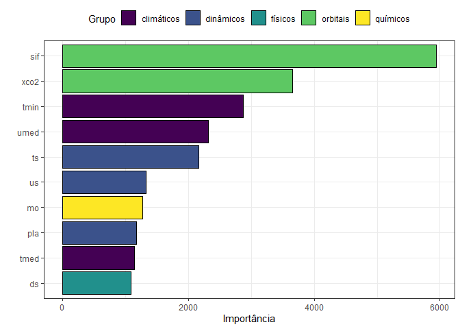<!-- -->

### Principais Métricas

``` r
da <- fco2_test_preds |>
  filter(fco2 > 0, .pred > 0)

my_r <- cor(da$fco2,da$.pred)
my_r2 <- my_r*my_r
my_mse <- Metrics::mse(da$fco2,da$.pred)
my_rmse <- Metrics::rmse(da$fco2,
                         da$.pred)
my_mae <- Metrics::mae(da$fco2,da$.pred)
my_mape <- Metrics::mape(da$fco2,da$.pred)*100

vector_of_metrics <- c(r=my_r, R2=my_r2, MSE=my_mse, RMSE=my_rmse, MAE=my_mae, MAPE=my_mape)
print(data.frame(vector_of_metrics))
#>      vector_of_metrics
#> r            0.8160888
#> R2           0.6660009
#> MSE          1.3785846
#> RMSE         1.1741314
#> MAE          0.7527157
#> MAPE        43.7947178
#>      vector_of_metrics
#> r            0.6787708
#> R2           0.4607298
#> MSE          0.1984555
#> RMSE         0.4454834
#> MAE          0.3259117
#> MAPE        25.2042723
```

## RANDOM FOREST

#### Definir os parâmetros da tunagem

``` r
fco2_rf_model <- rand_forest(
  min_n = tune(),
  mtry = tune(),
  trees = tune()
)   %>%
  set_mode("regression")  %>%
  set_engine("randomForest")
```

#### Workflow e tunagem

``` r
fco2_rf_wf <- workflow()   |>
  add_model(fco2_rf_model) |>
  add_recipe(fco2_recipe)

grid_rf <- grid_regular(
  min_n(range = c(20, 30)),
  mtry(range = c(5,10)),
  trees(range = c(10,50) ),
  levels = 2 #<-----------------------
)

fco2_rf_tune_grid <- tune_grid(
  fco2_rf_wf,
  resamples = fco2_resamples,
  grid = grid_rf,
  metrics = metric_set(rmse) )
autoplot(fco2_rf_tune_grid)
```

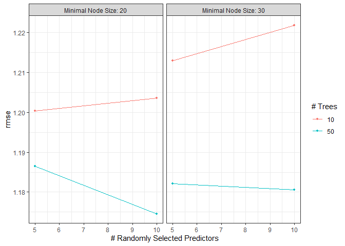<!-- -->

### Coletando métricas

``` r
collect_metrics(fco2_rf_tune_grid)
#> # A tibble: 8 × 9
#>    mtry trees min_n .metric .estimator  mean     n std_err .config        
#>   <int> <int> <int> <chr>   <chr>      <dbl> <int>   <dbl> <chr>          
#> 1     5    10    20 rmse    standard    1.20     5  0.0222 pre0_mod1_post0
#> 2     5    10    30 rmse    standard    1.21     5  0.0333 pre0_mod2_post0
#> 3     5    50    20 rmse    standard    1.19     5  0.0193 pre0_mod3_post0
#> 4     5    50    30 rmse    standard    1.18     5  0.0167 pre0_mod4_post0
#> 5    10    10    20 rmse    standard    1.20     5  0.0165 pre0_mod5_post0
#> 6    10    10    30 rmse    standard    1.22     5  0.0205 pre0_mod6_post0
#> 7    10    50    20 rmse    standard    1.17     5  0.0187 pre0_mod7_post0
#> 8    10    50    30 rmse    standard    1.18     5  0.0205 pre0_mod8_post0
fco2_rf_tune_grid |>
  show_best(metric = "rmse", n = 6)
#> # A tibble: 6 × 9
#>    mtry trees min_n .metric .estimator  mean     n std_err .config        
#>   <int> <int> <int> <chr>   <chr>      <dbl> <int>   <dbl> <chr>          
#> 1    10    50    20 rmse    standard    1.17     5  0.0187 pre0_mod7_post0
#> 2    10    50    30 rmse    standard    1.18     5  0.0205 pre0_mod8_post0
#> 3     5    50    30 rmse    standard    1.18     5  0.0167 pre0_mod4_post0
#> 4     5    50    20 rmse    standard    1.19     5  0.0193 pre0_mod3_post0
#> 5     5    10    20 rmse    standard    1.20     5  0.0222 pre0_mod1_post0
#> 6    10    10    20 rmse    standard    1.20     5  0.0165 pre0_mod5_post0
```

### Desempenho do modelo final

``` r
fco2_rf_best_params <- select_best(fco2_rf_tune_grid, metric = "rmse")
fco2_rf_wf <- fco2_rf_wf |>
  finalize_workflow(fco2_rf_best_params)
fco2_rf_last_fit <- last_fit(fco2_rf_wf, fco2_initial_split)

## Criando os preditos
fco2_test_preds <- bind_rows(
  collect_predictions(fco2_rf_last_fit)  |>
    mutate(modelo = "rf"))

fco2_test <- testing(fco2_initial_split)

fco2_test_preds |>
  ggplot(aes(x=.pred, y=fco2)) +
  geom_point()+
  theme_bw() +
  geom_smooth(method = "lm") +
  stat_regline_equation(ggplot2::aes(
  label =  paste(..eq.label.., ..rr.label.., sep = "*plain(\",\")~~"))) +
  geom_abline (slope=1, linetype = "dashed", color="Red")
```

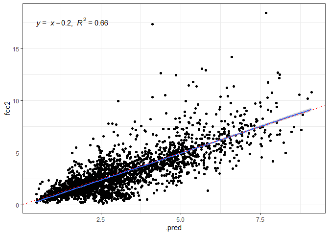<!-- -->

## Salvando o modelo final

``` r
fco2_modelo_final <- fco2_rf_wf |>
  fit(data_set)
saveRDS(fco2_modelo_final, "models/fco2_modelo_rf_2.rds")
```

``` r
# Extract the actual training data from your workflow
 fco2_rf_last_fit_model <-fco2_rf_last_fit$.workflow[[1]]$fit$fit
 # vip(fco2_rf_last_fit_model,
 #     aesthetics = list(color = "black", fill = "orange")) +
 #     theme(axis.text.y=element_text(size=rel(1.5)),
 #           axis.text.x=element_text(size=rel(1.5)),
 #           axis.title.x=element_text(size=rel(1.5))
 #           )
```

``` r
importance_top_10 <- vi(fco2_rf_last_fit_model) |>
  arrange(desc(Importance)) |>
  slice(1:10)

importance_top_10 |>
  mutate(feature_type = case_when(
    Variable %in% physical_var   ~ "físicos",
    Variable %in% chemical_var  ~ "químicos",
    Variable %in% din_var ~ "dinâmicos",
    Variable %in% meteorological_var ~ "climáticos",
    Variable %in% orbital_var  ~ "orbitais",
    Variable %in% textural_var  ~ "textura",
    Variable %in% time_var  ~ "tempo",
    TRUE                        ~ "manejo"
  ),
  Variable = Variable |> fct_reorder(Importance)) |>
  ggplot(aes(x=Importance, y=Variable, fill = feature_type)) +
  geom_col(color="black") +
  theme_bw()+
  labs(x = "Importância",y="",
       fill="Grupo") +
  theme(legend.position = "top") +
  scale_fill_viridis_d()
```

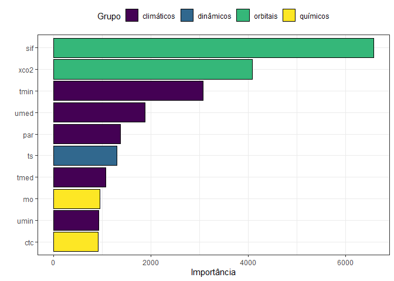<!-- -->

### Principais Métricas

``` r
da <- fco2_test_preds |>
  filter(fco2 > 0, .pred > 0)

my_r <- cor(da$fco2,da$.pred)
my_r2 <- my_r*my_r
my_mse <- Metrics::mse(da$fco2,da$.pred)
my_rmse <- Metrics::rmse(da$fco2,
                         da$.pred)
my_mae <- Metrics::mae(da$fco2,da$.pred)
my_mape <- Metrics::mape(da$fco2,da$.pred)*100

vector_of_metrics <- c(r=my_r, R2=my_r2, MSE=my_mse, RMSE=my_rmse, MAE=my_mae, MAPE=my_mape)
print(data.frame(vector_of_metrics))
#>      vector_of_metrics
#> r            0.8125857
#> R2           0.6602955
#> MSE          1.4006088
#> RMSE         1.1834732
#> MAE          0.7658962
#> MAPE        44.1029740
#>      vector_of_metrics
#> r            0.6787708
#> R2           0.4607298
#> MSE          0.1984555
#> RMSE         0.4454834
#> MAE          0.3259117
#> MAPE        25.2042723
```

## Decision TREE - DT

#### Definir os parâmetros da tunagem

``` r
fco2_dt_model <- decision_tree(
 cost_complexity = tune(), # Quanto maior mais poda é realizada na árvore,
 tree_depth = tune(),  # Limitar evita criação de regras complexas 
 min_n = tune() #número mín de obs em um nó para ser / em sub-nós.
)  |> 
set_mode("regression")  |> 
 set_engine("rpart")
```

#### Workflow e tunagem

``` r
fco2_dt_wf <- workflow()   |> 
  add_model(fco2_dt_model) |> 
  add_recipe(fco2_recipe)

grid_dt <- grid_regular( 
  cost_complexity(c(-6, -2)), 
  tree_depth(range = c(8, 80)), 
  min_n(range = c(20, 100)), 
  levels = 2) #<---------------------

fco2_dt_tune_grid <- tune_grid( 
  fco2_dt_wf,
  resamples = fco2_resamples,
  grid = grid_dt,
  metrics = metric_set(rmse) )
autoplot(fco2_dt_tune_grid)
```

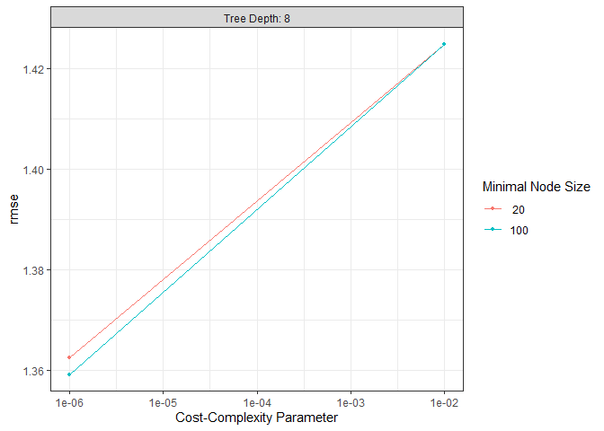<!-- -->

### Coletando métricas

``` r
collect_metrics(fco2_dt_tune_grid)
#> # A tibble: 4 × 9
#>   cost_complexity tree_depth min_n .metric .estimator  mean     n std_err
#>             <dbl>      <int> <int> <chr>   <chr>      <dbl> <int>   <dbl>
#> 1        0.000001          8    20 rmse    standard    1.36     5  0.0364
#> 2        0.000001          8   100 rmse    standard    1.36     5  0.0350
#> 3        0.01              8    20 rmse    standard    1.42     5  0.0385
#> 4        0.01              8   100 rmse    standard    1.42     5  0.0385
#> # ℹ 1 more variable: .config <chr>
fco2_dt_tune_grid |> 
  show_best(metric = "rmse", n = 6)
#> # A tibble: 4 × 9
#>   cost_complexity tree_depth min_n .metric .estimator  mean     n std_err
#>             <dbl>      <int> <int> <chr>   <chr>      <dbl> <int>   <dbl>
#> 1        0.000001          8   100 rmse    standard    1.36     5  0.0350
#> 2        0.000001          8    20 rmse    standard    1.36     5  0.0364
#> 3        0.01              8    20 rmse    standard    1.42     5  0.0385
#> 4        0.01              8   100 rmse    standard    1.42     5  0.0385
#> # ℹ 1 more variable: .config <chr>
```

### Desempenho do modelo final

``` r
fco2_dt_best_params <- select_best(fco2_dt_tune_grid, metric = "rmse")
fco2_dt_wf <- fco2_dt_wf |> 
  finalize_workflow(fco2_dt_best_params)
fco2_dt_last_fit <- last_fit(fco2_dt_wf, fco2_initial_split)

## Criando os preditos
fco2_test_preds <- bind_rows(
  collect_predictions(fco2_dt_last_fit)  |> 
    mutate(modelo = "dt"))

fco2_test <- testing(fco2_initial_split)

fco2_test_preds |> 
  ggplot(aes(x=.pred, y=fco2)) +
  geom_point()+
  theme_bw() +
  geom_smooth(method = "lm") +
  stat_regline_equation(ggplot2::aes(
  label =  paste(..eq.label.., ..rr.label.., sep = "*plain(\",\")~~"))) +
  geom_abline (slope=1, linetype = "dashed", color="Red")
```

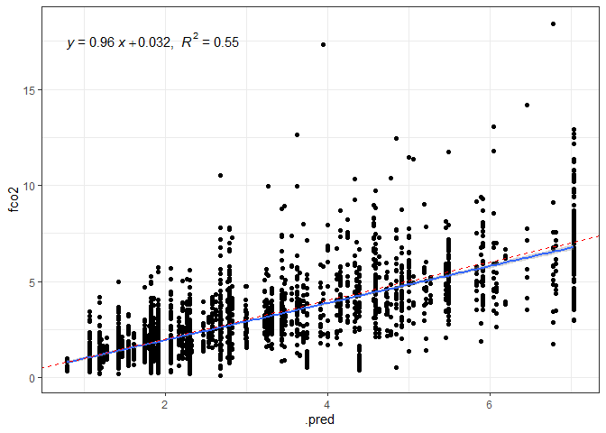<!-- -->

## Salvando o modelo final

``` r
fco2_modelo_final <- fco2_dt_wf |> 
  fit(data_set)
saveRDS(fco2_modelo_final, "models/fco2_modelo_dt_.rds")
```

``` r
# Extract the actual training data from your workflow
 fco2_dt_last_fit_model <-fco2_dt_last_fit$.workflow[[1]]$fit$fit
 # vip(fco2_dt_last_fit_model,
 #     aesthetics = list(color = "black", fill = "orange")) +
 #     theme(axis.text.y=element_text(size=rel(1.5)),
 #           axis.text.x=element_text(size=rel(1.5)),
 #           axis.title.x=element_text(size=rel(1.5))
 #           )
```

``` r
importance_top_10 <- vi(fco2_dt_last_fit_model) |> 
  arrange(desc(Importance)) |> 
  slice(1:10)

importance_top_10 |> 
  mutate(feature_type = case_when(
    Variable %in% physical_var   ~ "físicos",
    Variable %in% chemical_var  ~ "químicos",
    Variable %in% din_var ~ "dinâmicos",
    Variable %in% meteorological_var ~ "climáticos",
    Variable %in% orbital_var  ~ "orbitais",
    Variable %in% textural_var  ~ "textura",
    Variable %in% time_var  ~ "tempo",
    TRUE                        ~ "manejo"
  ),
  Variable = Variable |> fct_reorder(Importance)) |> 
  ggplot(aes(x=Importance, y=Variable, fill = feature_type)) +
  geom_col(color="black") +
  theme_bw()+
  labs(x = "Importância",y="",
       fill="Grupo") +
  theme(legend.position = "top") +
  scale_fill_viridis_d()
```

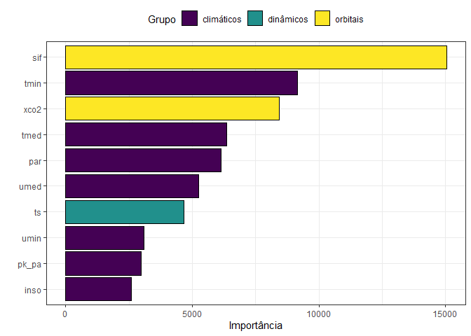<!-- -->

### Principais Métricas

``` r
da <- fco2_test_preds |> 
  filter(fco2 > 0, .pred > 0)

my_r <- cor(da$fco2,da$.pred)
my_r2 <- my_r*my_r
my_mse <- Metrics::mse(da$fco2,da$.pred)
my_rmse <- Metrics::rmse(da$fco2,
                         da$.pred)
my_mae <- Metrics::mae(da$fco2,da$.pred)
my_mape <- Metrics::mape(da$fco2,da$.pred)*100

vector_of_metrics <- c(r=my_r, R2=my_r2, MSE=my_mse, RMSE=my_rmse, MAE=my_mae, MAPE=my_mape)
print(data.frame(vector_of_metrics))
#>      vector_of_metrics
#> r            0.7448805
#> R2           0.5548470
#> MSE          1.8260816
#> RMSE         1.3513259
#> MAE          0.9018421
#> MAPE        50.9211599
#>      vector_of_metrics
#> r            0.6787708
#> R2           0.4607298
#> MSE          0.1984555
#> RMSE         0.4454834
#> MAE          0.3259117
#> MAPE        25.2042723
```

### Visualização da árvore

``` r
tree_fit_rpart <- extract_fit_engine(fco2_dt_last_fit) 
  png("output/decision-tree.png",         # File name
       width = 1900, height = 1000)
    rpart.plot::rpart.plot(tree_fit_rpart,cex=.8,roundint=FALSE)
    dev.off()
#> png 
#>   2
```

## SUPPORT VECTOR MACHINE - RDF

#### ϵ-insensitive loss regression (Flavor).

<https://bradleyboehmke.github.io/HOML/svm.html>
<https://stackoverflow.com/questions/77735850/variable-importance-plot-for-support-vector-machine-with-tidymodel-framework-is>

#### Definição do Modelo de Função de Base Radial

#### Definir os parâmetros da tunagem

``` r
fco2_svm_model <- svm_rbf(
  cost = tune(), 
  rbf_sigma = tune(), 
  margin = tune()) |>  # margin sempre para regressão
  set_mode("regression") |> 
  set_engine("kernlab") #%>%
 #translate()
```

#### Workflow e tunagem

``` r
fco2_svm_wf <- workflow()   |> 
  add_model(fco2_svm_model) |> 
  add_recipe(fco2_recipe)

grid_svm <- expand.grid( 
  cost = c(0.01), #0.0625, 0.1, 1, 10, 20,
  rbf_sigma = c(0.001),  #0.095,
  margin = c(-3,-2) # 0.025,
)
glimpse(grid_svm)
#> Rows: 2
#> Columns: 3
#> $ cost      <dbl> 0.01, 0.01
#> $ rbf_sigma <dbl> 0.001, 0.001
#> $ margin    <dbl> -3, -2

fco2_svm_tune_grid <- tune_grid(
  fco2_svm_wf,
  resamples = fco2_resamples,
  grid = grid_svm,
  metrics = metric_set(rmse)
)
autoplot(fco2_svm_tune_grid)
```

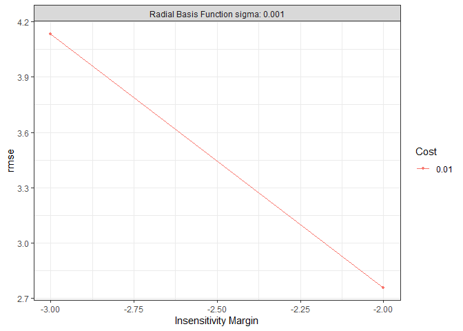<!-- -->

### Coletando métricas

``` r
collect_metrics(fco2_svm_tune_grid)
#> # A tibble: 2 × 9
#>    cost rbf_sigma margin .metric .estimator  mean     n std_err .config        
#>   <dbl>     <dbl>  <dbl> <chr>   <chr>      <dbl> <int>   <dbl> <chr>          
#> 1  0.01     0.001     -3 rmse    standard    4.13     5 0.00786 pre0_mod1_post0
#> 2  0.01     0.001     -2 rmse    standard    2.76     5 0.0139  pre0_mod2_post0
fco2_svm_tune_grid |> 
  show_best(metric = "rmse", n = 6)
#> # A tibble: 2 × 9
#>    cost rbf_sigma margin .metric .estimator  mean     n std_err .config        
#>   <dbl>     <dbl>  <dbl> <chr>   <chr>      <dbl> <int>   <dbl> <chr>          
#> 1  0.01     0.001     -2 rmse    standard    2.76     5 0.0139  pre0_mod2_post0
#> 2  0.01     0.001     -3 rmse    standard    4.13     5 0.00786 pre0_mod1_post0
```

### Desempenho do modelo final

``` r
fco2_svm_best_params <- select_best(fco2_svm_tune_grid, metric = "rmse")
fco2_svm_wf <- fco2_svm_wf |> 
  finalize_workflow(fco2_svm_best_params)
fco2_svm_last_fit <- last_fit(fco2_svm_wf, fco2_initial_split)

## Criando os preditos
fco2_test_preds <- bind_rows(
  collect_predictions(fco2_svm_last_fit)  |> 
    mutate(modelo = "svm"))

fco2_test <- testing(fco2_initial_split)

fco2_test_preds |> 
  ggplot(aes(x=.pred, y=fco2)) +
  geom_point()+
  theme_bw() +
  geom_smooth(method = "lm") +
  stat_regline_equation(ggplot2::aes(
  label =  paste(..eq.label.., ..rr.label.., sep = "*plain(\",\")~~"))) +
  geom_abline (slope=1, linetype = "dashed", color="Red")
```

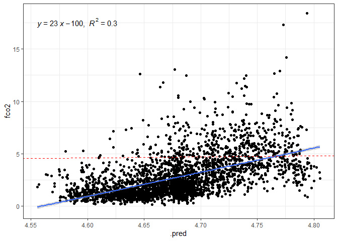<!-- -->

## Salvando o modelo final

``` r
fco2_modelo_final <- fco2_svm_wf |> 
  fit(data_set)
saveRDS(fco2_modelo_final, "models/fco2_modelo_svm_.rds")
```

``` r
# Extract the actual training data from your workflow
training_data <- fco2_svm_last_fit$.workflow[[1]]$pre$mold$predictors
training_target <- fco2_svm_last_fit$.workflow[[1]]$pre$mold$outcomes$fco2

# First, create the vip plot and store it
vip_plot <- fco2_modelo_final |> 
  extract_fit_parsnip() |>  
  vip( 
    method = "permute", 
    target = "fco2", 
    metric = "rmse", 
    nsim = 5, 
    pred_wrapper = function(object, newdata) {
      workflow_pred <- fco2_svm_last_fit$.workflow[[1]]
      predict(workflow_pred, newdata) %>% pull(.pred)
    },
    train = fco2_train,
    aesthetics = list(color = "black", fill = "orange")) + 
  theme(axis.text.y=element_text(size=rel(1.5)), 
        axis.text.x=element_text(size=rel(1.5)), 
        axis.title.x=element_text(size=rel(1.5))
  )
```

``` r
importance_top_10 <- vip_plot$data

importance_top_10 |> 
  mutate(feature_type = case_when(
    Variable %in% physical_var   ~ "físicos",
    Variable %in% chemical_var  ~ "químicos",
    Variable %in% din_var ~ "dinâmicos",
    Variable %in% meteorological_var ~ "climáticos",
    Variable %in% orbital_var  ~ "orbitais",
    Variable %in% textural_var  ~ "textura",
    Variable %in% time_var  ~ "tempo",
    TRUE                        ~ "manejo"
  ),
  Variable = Variable |> fct_reorder(Importance)) |> 
  ggplot(aes(x=Importance, y=Variable, fill = feature_type)) +
  geom_col(color="black") +
  theme_bw()+
  labs(x = "Importância",y="",
       fill="Grupo") +
  theme(legend.position = "top") +
  scale_fill_viridis_d()
```

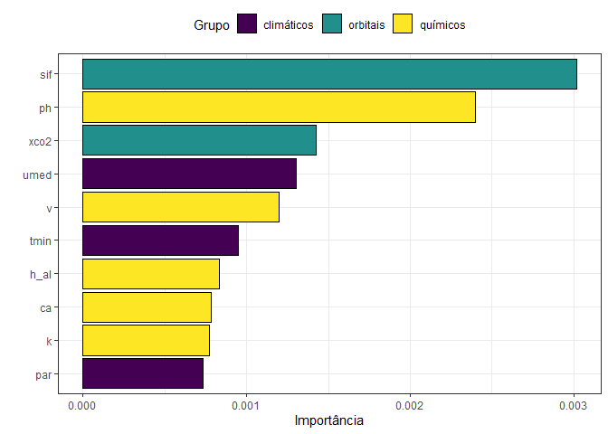<!-- -->

### Principais Métricas

``` r
da <- fco2_test_preds |> 
  filter(fco2 > 0, .pred > 0)

my_r <- cor(da$fco2,da$.pred)
my_r2 <- my_r*my_r
my_mse <- Metrics::mse(da$fco2,da$.pred)
my_rmse <- Metrics::rmse(da$fco2,
                         da$.pred)
my_mae <- Metrics::mae(da$fco2,da$.pred)
my_mape <- Metrics::mape(da$fco2,da$.pred)*100

vector_of_metrics <- c(r=my_r, R2=my_r2, MSE=my_mse, RMSE=my_rmse, MAE=my_mae, MAPE=my_mape)
print(data.frame(vector_of_metrics))
#>      vector_of_metrics
#> r             0.548518
#> R2            0.300872
#> MSE           7.641555
#> RMSE          2.764336
#> MAE           2.461914
#> MAPE        184.043514
#>      vector_of_metrics
#> r            0.6787708
#> R2           0.4607298
#> MSE          0.1984555
#> RMSE         0.4454834
#> MAE          0.3259117
#> MAPE        25.2042723
```

## REDE NEURAL ARTIFICIAL

#### Definição do Modelo de RNA - MultiLayer Perceptron

``` r
fco2_nn_model <- mlp() |>  # margin sempre para regressão
  set_mode("regression") |> 
  set_engine("nnet")
```

#### Definir os parâmetros da tunagem

``` r
fco2_nn_model <- mlp(
  hidden_units = tune(),
  penalty = tune(),
  epochs = tune()
  ) |>  # margin sempre para regressão
  set_mode("regression") |> 
  set_engine("nnet")
```

#### Workflow e tunagem

``` r
fco2_nn_wf <- workflow()   |> 
  add_model(fco2_nn_model) |> 
  add_recipe(fco2_recipe)
# Criando a matriz (grid) com os valores de hiperparâmetros a serem testados
# grid_nn <- expand.grid(
#   hidden_units = c(1,5,6,7,8,15), #c(1,5,6,7,8,15)
#   penalty = c(1,20),  #c(1,5,10,20)
#   epochs = c(50,1000) # c(50,100,500,1000)
# )

grid_nn <- grid_regular(
  hidden_units(range = c(10, 60)), ## tentar até 250
  penalty(range = c(-5, 10), trans = scales::log10_trans()), ## no máximo 30
  epochs(range = c(75, 80)),
  levels = c(2, 2, 2)
)
glimpse(grid_nn)
#> Rows: 8
#> Columns: 3
#> $ hidden_units <int> 10, 60, 10, 60, 10, 60, 10, 60
#> $ penalty      <dbl> 1e-05, 1e-05, 1e+10, 1e+10, 1e-05, 1e-05, 1e+10, 1e+10
#> $ epochs       <int> 75, 75, 75, 75, 80, 80, 80, 80

fco2_nn_tune_grid <- tune_grid(
  fco2_nn_wf,
  resamples = fco2_resamples,
  grid = grid_nn,
  metrics = metric_set(rmse)
)
autoplot(fco2_nn_tune_grid)
```

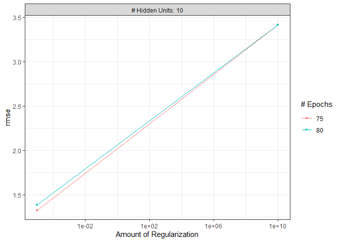<!-- -->

### Coletando métricas

``` r
collect_metrics(fco2_nn_tune_grid)
#> # A tibble: 4 × 9
#>   hidden_units penalty epochs .metric .estimator  mean     n std_err .config    
#>          <int>   <dbl>  <int> <chr>   <chr>      <dbl> <int>   <dbl> <chr>      
#> 1           10   1e- 5     75 rmse    standard    1.33     5 0.0139  pre0_mod1_…
#> 2           10   1e- 5     80 rmse    standard    1.39     5 0.0274  pre0_mod2_…
#> 3           10   1e+10     75 rmse    standard    3.42     5 0.00583 pre0_mod3_…
#> 4           10   1e+10     80 rmse    standard    3.42     5 0.00583 pre0_mod4_…
fco2_nn_tune_grid |> 
  show_best(metric = "rmse", n = 6)
#> # A tibble: 4 × 9
#>   hidden_units penalty epochs .metric .estimator  mean     n std_err .config    
#>          <int>   <dbl>  <int> <chr>   <chr>      <dbl> <int>   <dbl> <chr>      
#> 1           10   1e- 5     75 rmse    standard    1.33     5 0.0139  pre0_mod1_…
#> 2           10   1e- 5     80 rmse    standard    1.39     5 0.0274  pre0_mod2_…
#> 3           10   1e+10     75 rmse    standard    3.42     5 0.00583 pre0_mod3_…
#> 4           10   1e+10     80 rmse    standard    3.42     5 0.00583 pre0_mod4_…
```

### Desempenho do modelo final

``` r
fco2_nn_best_params <- select_best(fco2_nn_tune_grid, metric = "rmse")
fco2_nn_wf <- fco2_nn_wf |> 
  finalize_workflow(fco2_nn_best_params)
fco2_nn_last_fit <- last_fit(fco2_nn_wf, fco2_initial_split)

## Criando os preditos
fco2_test_preds <- bind_rows(
  collect_predictions(fco2_nn_last_fit)  |> 
    mutate(modelo = "nn"))

fco2_test <- testing(fco2_initial_split)

fco2_test_preds |> 
  ggplot(aes(x=.pred, y=fco2)) +
  geom_point()+
  theme_bw() +
  geom_smooth(method = "lm") +
  stat_regline_equation(ggplot2::aes(
  label =  paste(..eq.label.., ..rr.label.., sep = "*plain(\",\")~~"))) +
  geom_abline (slope=1, linetype = "dashed", color="Red")
```

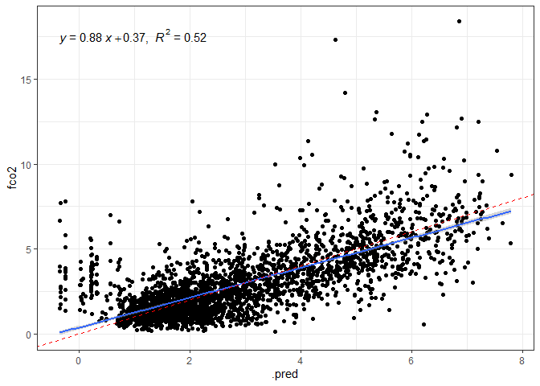<!-- -->

## Salvando o modelo final

``` r
fco2_modelo_final <- fco2_nn_wf |> 
  fit(data_set)
saveRDS(fco2_modelo_final, "models/fco2_modelo_nn_.rds")
```

``` r
fco2_nn_last_fit_model <- fco2_nn_last_fit$.workflow[[1]]$fit$fit
# vip(fco2_nn_last_fit_model,
#     aesthetics = list(color = "black", fill = "orange")) +
#     theme(axis.text.y=element_text(size=rel(1.5)),
#           axis.text.x=element_text(size=rel(1.5)),
#           axis.title.x=element_text(size=rel(1.5))
#           ) +
#   theme_bw()
```

``` r
importance_top_10 <- vi(fco2_nn_last_fit_model) |> 
  arrange(desc(Importance)) |> 
  slice(1:10)

importance_top_10 |> 
  mutate(feature_type = case_when(
    Variable %in% physical_var   ~ "físicos",
    Variable %in% chemical_var  ~ "químicos",
    Variable %in% din_var ~ "dinâmicos",
    Variable %in% meteorological_var ~ "climáticos",
    Variable %in% orbital_var  ~ "orbitais",
    Variable %in% textural_var  ~ "textura",
    Variable %in% time_var  ~ "tempo",
    TRUE                        ~ "manejo"
  ),
  Variable = Variable |> fct_reorder(Importance)) |> 
  ggplot(aes(x=Importance, y=Variable, fill = feature_type)) +
  geom_col(color="black") +
  theme_bw()+
  labs(x = "Importância",y="",
       fill="Grupo") +
  theme(legend.position = "top") +
  scale_fill_viridis_d()
```

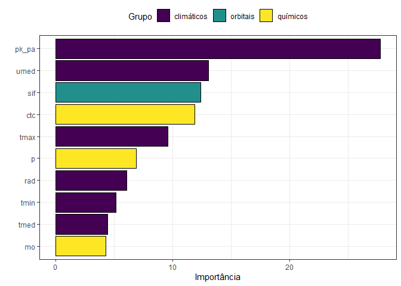<!-- -->

``` r

fco2_nn_last_fit_model$censor_probs |> str()
#>  list()
```

### Principais Métricas

``` r
da <- fco2_test_preds |> 
  filter(fco2 > 0, .pred>0 )

my_r <- cor(da$fco2,da$.pred)
my_r2 <- my_r*my_r
my_mse <- Metrics::mse(da$fco2,da$.pred)
my_rmse <- Metrics::rmse(da$fco2,
                         da$.pred)
my_mae <- Metrics::mae(da$fco2,da$.pred)
my_mape <- Metrics::mape(da$fco2,da$.pred)*100

vector_of_metrics <- c(r=my_r, R2=my_r2, MSE=my_mse, RMSE=my_rmse, MAE=my_mae, MAPE=my_mape)
print(data.frame(vector_of_metrics))
#>      vector_of_metrics
#> r            0.7399615
#> R2           0.5475431
#> MSE          1.8676662
#> RMSE         1.3666259
#> MAE          0.9207948
#> MAPE        48.5435464
#>      vector_of_metrics
#> r            0.6787708
#> R2           0.4607298
#> MSE          0.1984555
#> RMSE         0.4454834
#> MAE          0.3259117
#> MAPE        25.2042723
```

–\>
